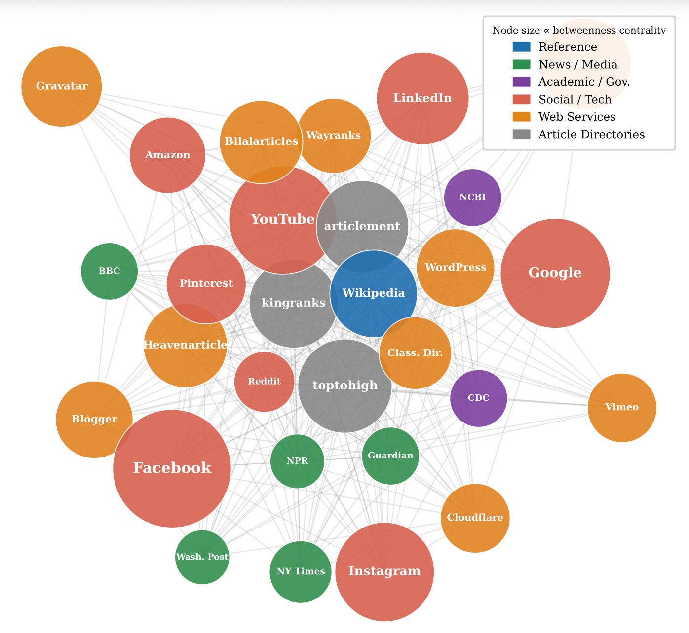

# WebGraphMix

Official code release for **Hubs or Fringes? Pretraining Data Selection via Web Graph Centrality** [[Paper](https://wangxinyilinda.github.io/pdf/WebGraphMix.pdf)][[Project Page](https://princeton-pli.github.io/WebGraphMix/)].



WebGraphMix uses structural centrality scores over the Common Crawl host-level web graph to construct pretraining mixtures of central vs. peripheral documents. This repository contains the graph pipeline, importance-sampling scripts, and a slim [DataComp-LM (DCLM)](https://github.com/mlfoundations/dclm) fork for training and evaluation at 400M and 1B scales.

- **HuggingFace (centrality scores):** [PrincetonPLI/cc-centrality-scores](https://huggingface.co/datasets/PrincetonPLI/cc-centrality-scores)
- **HuggingFace (1B checkpoints):** [PrincetonPLI/WebGraphMix-openlm-1B](https://huggingface.co/PrincetonPLI/WebGraphMix-openlm-1B)
- **Base corpus:** [WebOrganizer/Corpus-200B](https://huggingface.co/datasets/WebOrganizer/Corpus-200B)
- **WebOrganizer 1B baseline weights:** download from the [WebOrganizer HuggingFace collection](https://huggingface.co/WebOrganizer)

## Quick start: evaluate a checkpoint

```bash
# 1. Setup
conda env create -f environment.yml
conda activate webgraphmix
cd dclm && pip install -e . && cd ..

# 2. Download a pretrained 1B checkpoint
./experiments/artifacts/download.sh checkpoints

# 3. Evaluate derfault model on DCLM CORE v2 (23 tasks)
export REPO_ROOT=$(pwd)
./experiments/eval/mmlu_and_lowvar.sh

# 4. Aggregate scores into a comparison sheet
cd dclm/exp_data/evals && python benchmark_score_comparison.py
```

## Environment variables

| Variable | Default | Purpose |
|----------|---------|---------|
| `REPO_ROOT` | repo root | Code and centrality scores |
| `DATA_ROOT` | `$REPO_ROOT/corpus_200b` | Corpus-200B local copy |
| `HF_HOME` | `~/.cache/huggingface` | Tokenizer and HF models |

Path helpers live in `lib/paths.py` and are used across the pipeline scripts.

## Full reproduction pipeline

### Prerequisites

1. **Corpus-200B** (~hundreds of GB): download from [WebOrganizer/Corpus-200B](https://huggingface.co/datasets/WebOrganizer/Corpus-200B) into `$DATA_ROOT`.
2. **DCLM-fasttext quality scores**: included in Corpus-200B as `scores_dclm-fasttext/` shards, or regenerate via `dclm/baselines/`.
3. **GPU**: centrality computation needs GPUs with [cuGraph](https://github.com/rapidsai/cugraph); or download precomputed scores (recommended).

### Step-by-step

```text
1. Download CC host graph          python pipeline/graph/download_host_graph.py
2. Build corpus host graph         python pipeline/graph/build_host_graph.py
3. Compute centrality (optional)   python pipeline/graph/centrality/compute_{katz,betweenness,eigenvector}.py
                                   OR: ./experiments/artifacts/download.sh centrality
4. Generate annotations            python pipeline/annotations/centrality_topk.py --centrality-metric betweenness
5. Importance-sample documents     ./pipeline/sampling/run_sampling_job.sh  (see script for env vars)
6. Tokenize + shuffle              dclm/rust_processing/tokshuf-rs/run_rust_tokenizer.sh
7. Register dataset JSON           dclm/exp_data/datasets/tokenized/ (examples included)
8. Train OpenLM                    ./experiments/train/betweenness_50top.sh
9. Evaluate                        ./experiments/eval/mmlu_and_lowvar.sh
10. Convert to HF (optional)        python dclm/convert_openlm_to_hf_1b.py
```

### Headline 1B experiments (Table 1)

| Method | Train script | Dataset JSON |
|--------|-------------|--------------|
| Random baseline | `experiments/train/random.sh` | `baseline_random_corpus_32b.json` |
| Quality (DCLM-fasttext) | `experiments/train/quality.sh` | `quality_only_dclmfilter_corpus_32b.json` |
| WebGraphMix (50/50 betweenness) | `experiments/train/betweenness_50top.sh` | `betweenness_50top_corpus_32b.json` |
| WebGraphMix+ (multiply 50top) | `experiments/train/multiply_betweenness_50top.sh` | `centrality_dclmfilter_multiply/regular_bottomk/betweenness_50top_corpus_32b.json` |

Training uses `torchrun -m training.train` with scale `1b_1x_fast` (~28B tokens). See `dclm/training/configs/` for 400M (`411m_1x`) settings.

## Repository layout

```text
WebGraphMix_Public/
├── lib/
│   └── paths.py                    # Central path configuration (REPO_ROOT, DATA_ROOT, etc.)
├── pipeline/
│   ├── graph/
│   │   ├── download_host_graph.py  # Download CC host-graph shards
│   │   ├── build_host_graph.py     # Intersect CC graph with corpus hosts
│   │   ├── check_corpus_overlap.py
│   │   ├── doc_counts_by_host.py
│   │   ├── data/commoncrawl/       # CC graph path index files (small; large downloads gitignored)
│   │   └── centrality/             # GPU centrality scripts + precomputed scores (HF)
│   ├── annotations/                # Per-document annotation generation
│   └── sampling/
│       ├── select_training_data.py # Importance-based document sampling
│       └── run_sampling_job.sh
├── experiments/
│   ├── train/                      # Headline 1B training launchers
│   ├── eval/                       # DCLM CORE v2 evaluation
│   └── artifacts/                  # HuggingFace download/upload helpers
└── dclm/                           # DCLM fork: training, eval, tokshuf-rs
```

## Precomputed artifacts (HuggingFace)

Download instead of recomputing:

```bash
./experiments/artifacts/download.sh all
```

| Artifact | Size (approx.) | Contents |
|----------|----------------|----------|
| Centrality scores | ~1.8 GB | `host_graph_scores_{betweenness,katz,eigenvector}_*.json` |
| 1B checkpoints | ~17 GB each | random, quality, betweenness 50/50, multiply 50/50 |

To upload (maintainers):

```bash
./experiments/artifacts/upload.sh all
```

## Known issues

- **tokshuf local cells:** Create a temp directory (e.g. `tokshuf_tmp/`) via `LOCAL_CELL_DIR`; do not commit these directories.
<!-- - **`datatools`:** Required by `pipeline/sampling/select_training_data.py`; install via `pip install datatools==0.1.2` (see `requirements-graph.txt`). -->

## Citation

```bibtex
@article{badoni2026webgraphmix,
  title={Hubs or Fringes: Pretraining Data Selection via Web Graph Centrality},
  author={Badoni, Vedant and Chen, Danqi and Wang, Xinyi},
  year={2026}
}
```

## License

The `dclm/` subdirectory follows the [DCLM license](dclm/LICENSE). WebGraphMix-specific scripts are released under the same terms unless otherwise noted.
